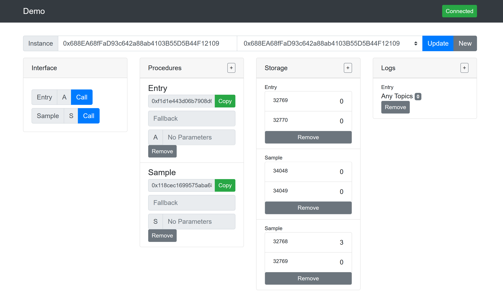

# BeakerOS Frontend Demo

## Overview
See the [guide](docs/guide.md) for more information

## Development

```bash
# Need to have npm installed
npm install

# serve with hot reload at localhost:8080
npm run serve

# start a test eth server in a seperate console
npm run eth-local
```


## Build

``` bash
# install dependencies
npm install

# serve with hot reload at localhost:8080
npm run serve

# build for production with minification
npm run build

# build for production and view the bundle analyzer report
npm run build --report
```

For a detailed explanation on how things work, check out the [guide](http://vuejs-templates.github.io/webpack/) and [docs for vue-loader](http://vuejs.github.io/vue-loader).
